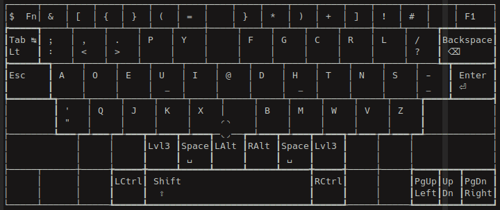
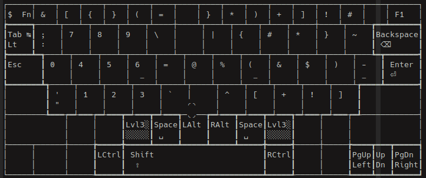
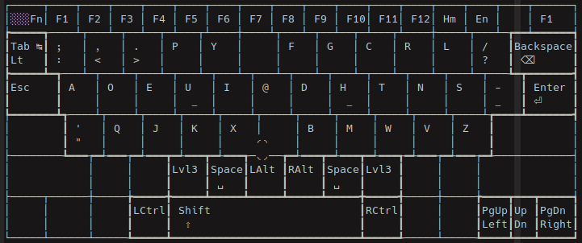
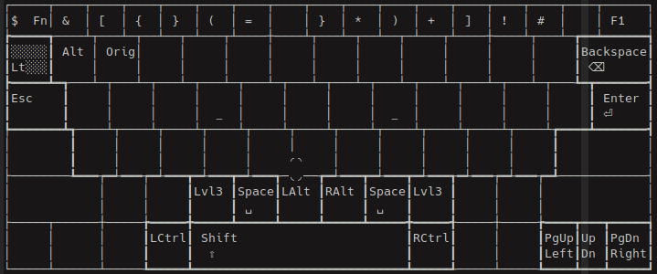
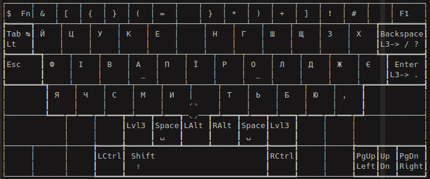

# keyflux
Ergonomic keyboard layout with easy access to modifier keys

## Introduction
Keyflux is mainly targeted at power users and others who value ergonomics, flow
of thought and speed.

## Features
- Based on programmer Dvorak
- Easy access to modifier keys
- Split arrangement for ergonomic spacing
- Multiple layers
- Digits and special symbols are separated from the main layer
- Special symbols are doubled to the first layer for easy access
- All of the hard-to-reach keys are removed

## Layer system
The main layout looks like the regular Dvorak layout with the upper row of
special symbols arranged like in programmers Dvorak and `Esc` right near the left
pinkie for easy access for Vim users. All modifier keys are accessed with
thumbs.


To access special symbols and digits hold one of the `Lvl3` keys. If you want to
use digits hold the right `Lvl3`, and use the left one otherwise.


To access `F1-12` keys press and hold the `$` key for more than 150 ms.


To switch to an alternative language layout there is `Lt` key. Holt it for more
than 150 ms and choose your layout.


Since I used Ukrainian layout, which has too many letters, I needed to hide some
punctuation signs under some of the commonly used keys.
To access `.` hold `Lvl3` key, and to access `?` hold `Lvl3-Shift`.


## Installation
Keyflux works on `kanata`. Install it with your package manager first, then do
```
sudo cp keyflux.kbd /etc/kanata.kbd
```
and restart the Kanata service with
```
sudo systemctl restart kanata
```
.
For Ukrainian or any other alternative layout to work you'll need to setup
configure Xkb appropriately. Open `/etc/X11/xorg.conf.d/00-keyboard.conf` with
the text editor of your choice and put something like this there:
```
Section "InputClass"
        Identifier "system-keyboard"
        MatchIsKeyboard "on"
        Option "XkbLayout" "us,ua"
        Option "XkbVariant" ",winkeys"
        Option "XkbOptions" "grp:caps_switch"
EndSection
```
In case you use Wayland this won't work.

## Note
Everything Kanata does is hooking into events from the kernel and interpreting
it the way you described in the configuration file. Therefore, it's crucial to
set the default QWERTY keyboard layout in your system settings.

## Contribution
Keyflux currently works only on GNU/Linux with Xorg. If you want to help the
project, I'd appreciate any help in adapting it for Wayland or Windows (e.g., with
AutoHotkey).
